# DRIVERS ARQUITECTÓNICOS

[Atributos de Calidad](https://docs.google.com/spreadsheets/d/1S_FjFUqPp5lyossS7RIULytX8pctjinT/edit?usp=sharing&ouid=100818533910801106935&rtpof=true&sd=true)

<b>Atributos de calidad</b>

  - Priorización de atributos
		 
        *Gráfico Radar*
         
		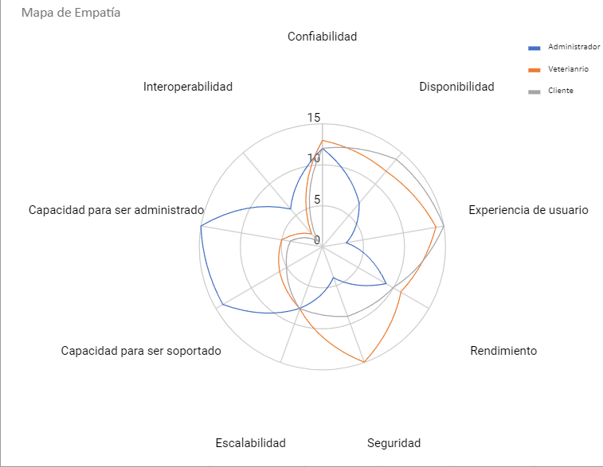
  
  - Características y escenarios de calidad
	- Confiabilidad
			 
			1.Características
			 
			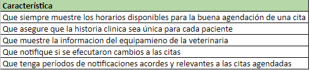 
			2.Escenarios 
				2.1. Escenario de Calidad 1
				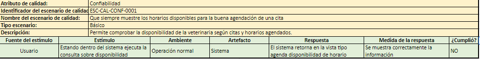
				2.2. Escenario de calidad 2
				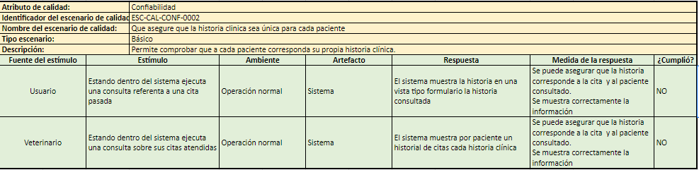
				2.3. Escenario de Calidad 3
				
				2.4. Escenario de calidad 4
				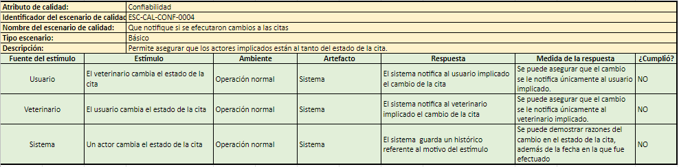
				2.5. Escenario de Calidad 5
				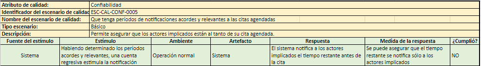
	- Disponibilidad
			 
			1.Características
			 
			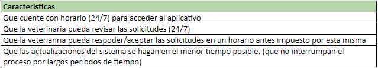 
			2.Escenarios 
				2.1. Escenario de Calidad 1
					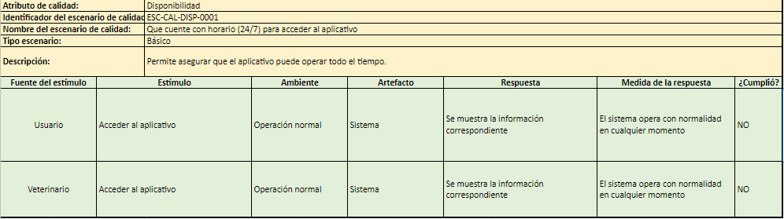
				2.2. Escenario de calidad 2
					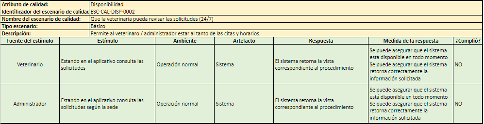
				2.3. Escenario de Calidad 3
					
				2.4. Escenario de calidad 4
					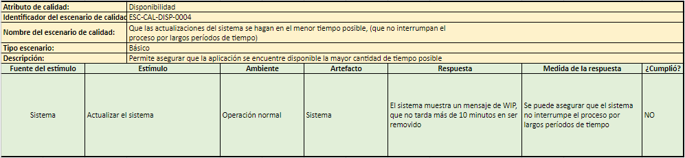
	- Rendimiento
			 
			1.Características
			 
			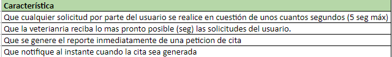 
			2.Escenarios 
				2.1. Escenario de Calidad 1
					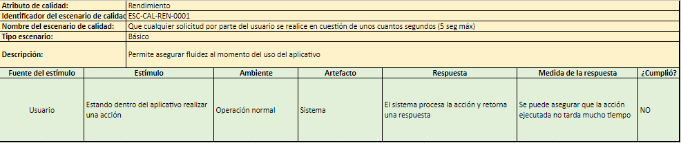
				2.2. Escenario de calidad 2
					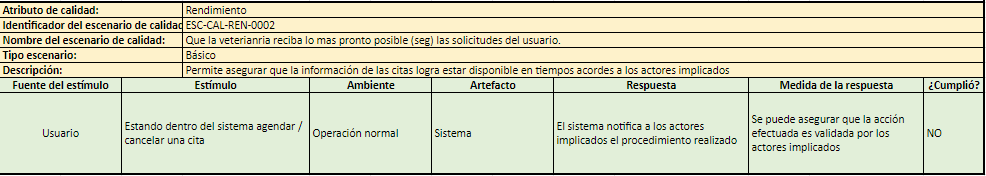
				2.3. Escenario de Calidad 3
					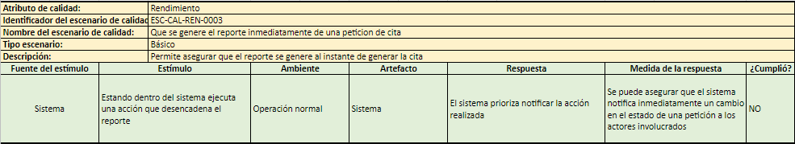
				2.4. Escenario de calidad 4
					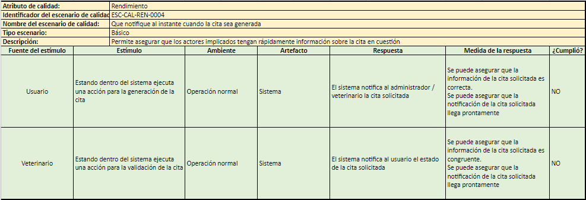
	- Experiencia de Usuario
			 
			1.Características
			 
			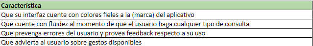
			 
			2.Escenarios 
				2.1. Escenario de Calidad 1
					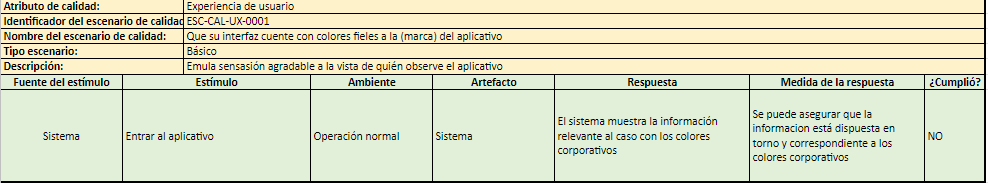
				2.2. Escenario de calidad 2
					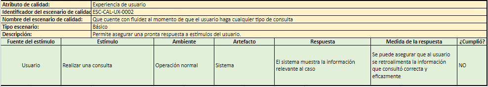
				2.3. Escenario de Calidad 3
					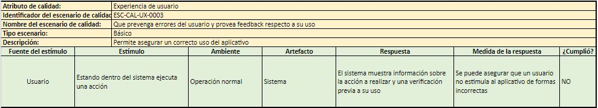
				2.4. Escenario de calidad 4
					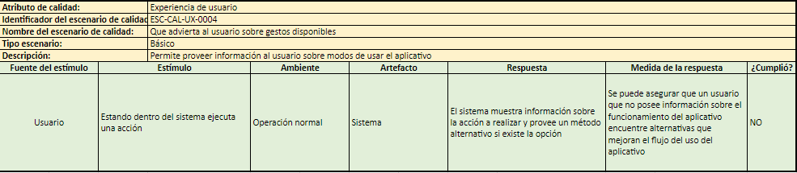		
	- Seguridad
			 
			1.Características
			 
			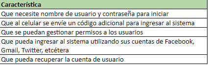
			 
			2.Escenarios 
				2.1. Escenario de Calidad 1
					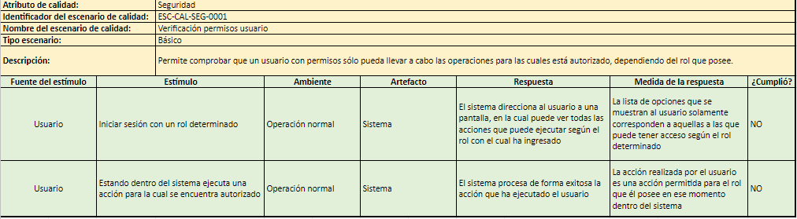
				2.2. Escenario de calidad 2
					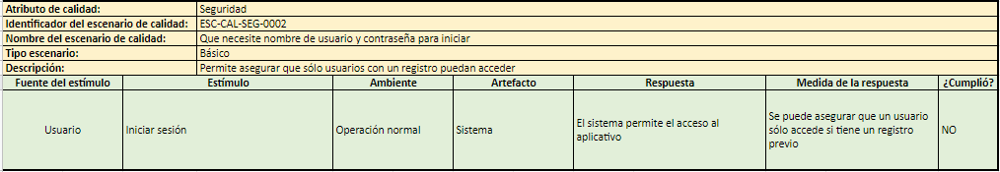
				2.3. Escenario de Calidad 3
					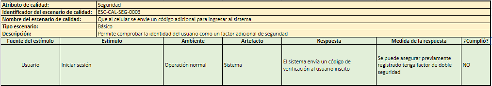
				2.4. Escenario de calidad 4
					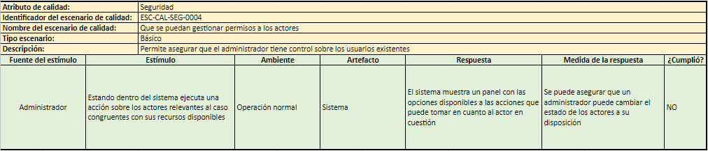	
				2.5. Escenario de calidad 5
					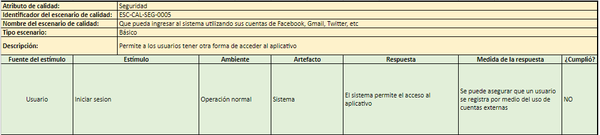		
				2.6. Escenario de calidad 6
					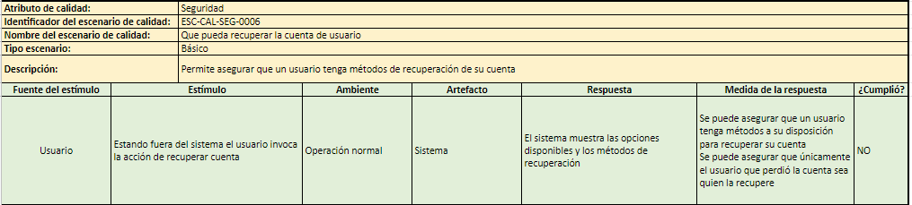

**Funcionalidades Críticas** 
  - **AGENDAMIENTO**:  El agendamiento va ligado a las distintas sedes, y a su vez va de la mano con los distintos veterinarios los cuales manejan su horario de acuerdo con la agenda previamente definida. Se garantiza un buen manejo y agendamiento de citas en cuanto a las distintas peticiones en el tiempo dado y con al menos tres horas de antelación, para que no ocurran errores ni cruces entre las distintas citas y horarios.
  - **ENVÍO NOTIFICACIONES**: El sistema notificará tanto al cliente como al veterinario sobre el agendamiento válido de una cita en un tiempo que se encuentre disponible.
	
	Se notificará tanto al cliente como al veterinario de llegar a pasar cualquiera de estas acciones: Cancelación de cita, Reprogramación de Cita.
	
	Se le notificará al cliente un Recordatorio previo a la Cita, para asegurar su asistencia.

**Restricciones Técnicas**
  - Funcionales:
  
	Funciones como administrar sedes y/o veterinarios sólo estarán disponibles para el rol de administrador
	Sólo el rol de administrador puede bloquear / eliminar otros usuarios.
		
	- El administrador puede:

		- Registrar veterinarias
		- Registrar sedes
		- Crear / modificar / eliminar / consultar tipos de sedes
		- Crear / modificar / eliminar / consultar consultorios
		- Bloquear / eliminar usuarios en el sistema
		- Crear / modificar / eliminar / consultar equipamiento por sede
		
	- Un veterinario puede:
	
		Crear, modificar o eliminar medicamentos
		
		Consultar medicamentos
		
		Consultar dueños
		
		Crear fórmulas
		
		Crear / seleccionar agendas
		
		Actualizar datos de sí mismo (veterinario)
		
		Modificar / eliminar citas
		
		Consultar / modificar / eliminar razas
		
		Eliminar veterinario (sí mismo)
		
	- Un dueño puede:
	
		Crear / modificar / eliminar una cuenta de usuario
		
		Consultar agendas
		
		Crear / modificar / eliminar citas
		
		Consultar citas
		
		Consultar historias clínicas
		
		Consultar fórmulas
		
		Crear / modificar / eliminar / consultar mascotas
		
		Crear / consultar razas

**Restricciones de Negocio**