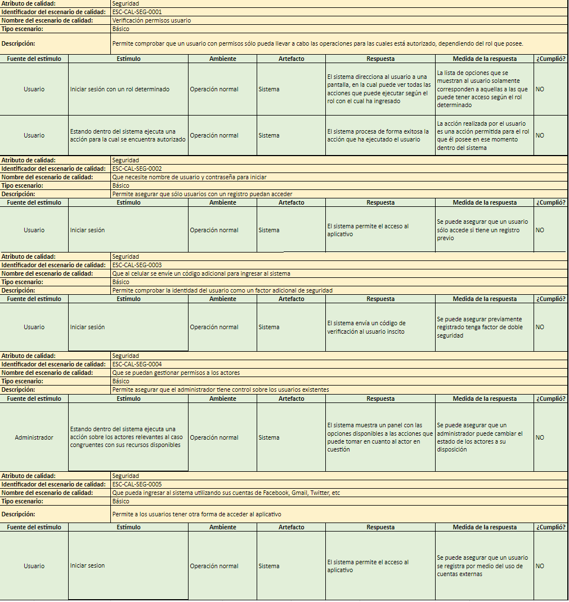

# DRIVERS ARQUITECTÓNICOS

**Atributos de calidad**
  - Priorización de atributos
		 
        *Gráfico Radar*
         
		
  
- Características y escenarios de calidad
  - Confiabilidad
		 
		1.Características
		 
		 
		2.Escenarios
  - Disponibilidad
		 
		1.Características
		 
		 
		2.Escenarios
  - Rendimiento
		 
		1.Características
		 
		 
		2.Escenarios
  - Experiencia de Usuario
		 
		1.Características
		 
		
		 
		2.Escenarios		
  - Seguridad
		 
		1.Características
		 
		
		 
		2.Escenarios
		 
		
		 
		
  
