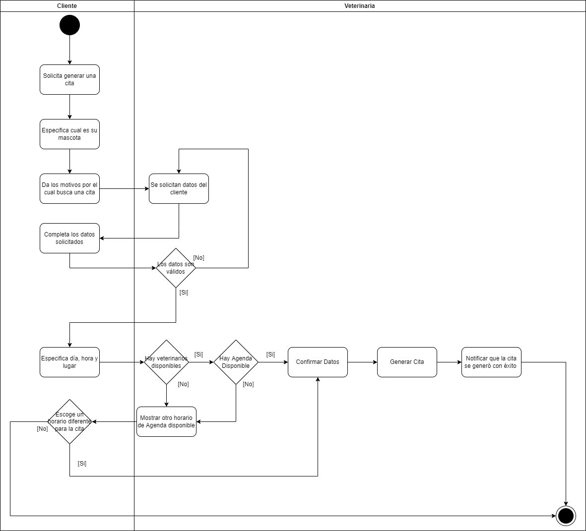

# Diagrama de Actividades

**Diagrama de actividades**

Permite describir cómo se relacionan y coordinan varias actividades, proporcionando un resultado o cómo los eventos se relacionan entre sí, particularmente sobre generar una cita, donde se describe el proceso que un usuario seguiría en UML, pasando por procesos de validación subsecuentes y relevantes al evento.

 

